# 网站性能优化实战——从12.67s到1.06s的故事

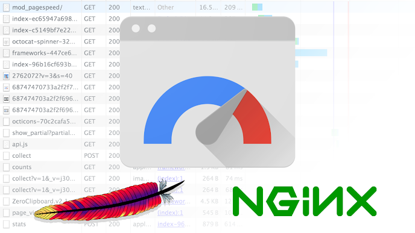

## 0.引言

作为互联网项目，最重要的便是用户体验。在举国“互联网+”的热潮中，用户至上也已经被大多数企业所接收，特别是在如今移动端快速发展的时代，我们的网页不仅只是呈现在用户的PC浏览器里，更多的时候，用户是通过移动产品浏览我们的网页。加之有越来越多的开发者投入到Web APP和Hybrid APP的开发队伍中，性能这一问题又再一次被提上了程序员们重点关注的要素。我曾经看到过这样一句话：一个网站的体验，决定了用户是否愿意去了解网站的功能；而网站的功能，决定了用户是否会一票否决网站的体验。这是改版自网络上的一句流行语，但却把网站性能这件事说的十分透彻，特别是在网站这样的项目中，如果一个用户需要超过5s才能看见页面，他会毫不犹豫地关闭它。性能优化，作为工程师界的“上乘武功”，是我们在开发中老生常谈的话题，也是一名开发者从入门向资深进阶的必经阶段，虽然我们看到过很多的标准、军规，但在真正实践中，却常常力不从心，不知道落下了什么，不知道性能是否还有进一步优化的空间。

对于网站的性能，在行业内有很多既定的指标，但就以前端er而言，我们应该更加关注以下指标：白屏时间、首屏时间、整页时间、DNS时间、CPU占用率。而我之前自己搭建的一个网站（网址：http://jerryonlyzrj.com/resume/，近日因域名备案无法打开，几日后即恢复正常），完全没做性能优化时，首屏时间是12.67s，最后经过多方面优化，终于将其降低至1.06s，并且还未配置CDN加速。其中过程我踩了很多坑，也翻了许多专业书籍，最后决定将这几日的努力整理成文，帮助前端爱好者们少走弯路。也欢迎大家关注我的Github，让我们一起在代码的海洋里策马奔腾：https://github.com/jerryOnlyZRJ 。

今天，我们将从性能优化的三大方面工作逐步展开介绍，其中包括网络传输性能、页面渲染性能以及JS阻塞性能，系统性地带着读者们体验性能优化的实践流程。

## 1.网络传输性能优化

在开始介绍网络传输性能优化这项工作之前，我们需要了解浏览器处理用户请求的过程，那么就必须奉上这幅神图了：


这是navigation timing监测指标图，从图中我们可以看出，浏览器在得到用户请求之后，经历了下面这些阶段：重定向→拉取缓存→DNS查询→建立TCP链接→发起请求→接收响应→处理HTML元素→元素加载完成。不着急，我们对其中的细节一步步展开讨论：

### 1.1.浏览器缓存

我们都知道，浏览器在向服务器发起请求前，会先查询本地是否有相同的文件，如果有，就会直接拉取本地缓存，这和我们在后台部属的Redis和Memcache类似，都是起到了中间缓冲的作用，我们先看看浏览器处理缓存的策略：

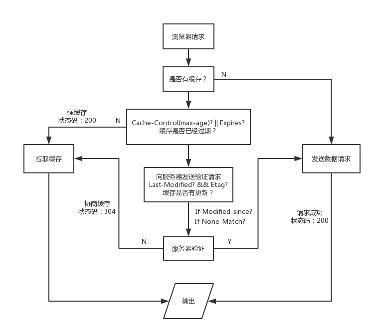

因为网上的图片太笼统了，而且我翻过很多讲缓存的文章，很少有将状态码还有什么时候将缓存存放在内存（memory）中什么时候缓存在硬盘中（disk）系统地整理出来，所以我自己绘制了一张浏览器缓存机制流程图，结合这张图再更深入地说明浏览器的缓存机制。

这里我们可以使用chrome devtools里的network面板查看网络传输的相关信息：

（这里需要特别注意，在我们进行缓存调试时，需要去除network面板顶部的`Disable cache` 勾选项，否则浏览器将始终不会从缓存中拉取数据）

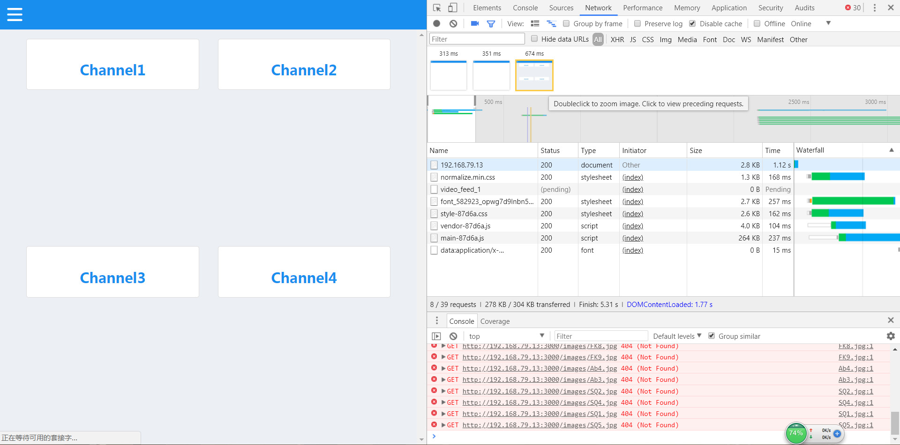

浏览器默认的缓存是放在内存内的，但我们知道，内存里的缓存会因为进程的结束或者说浏览器的关闭而被清除，而存在硬盘里的缓存才能够被长期保留下去。很多时候，我们在network面板中各请求的size项里，会看到两种不同的状态：`from memory cache` 和 `from disk cache`，前者指缓存来自内存，后者指缓存来自硬盘。而控制缓存存放位置的，不是别人，就是我们在服务器上设置的Etag字段。在浏览器接收到服务器响应后，会检测响应头部（Header），如果有Etag字段，那么浏览器就会将本次缓存写入硬盘中。

之所以拉取缓存会出现200、304两种不同的状态码，取决于浏览器是否有向服务器发起验证请求。 只有向服务器发起验证请求并确认缓存未被更新，才会返回304状态码。

这里我以nginx为例，谈谈如何配置缓存:

首先，我们先进入nginx的配置文档

`$ vim nginxPath/conf/nginx.conf`

在配置文档内插入如下两项：

```
etag on;   //开启etag验证
expires 7d;    //设置缓存过期时间为7天
```

打开我们的网站，在chrome devtools的network面板中观察我们的请求资源，如果在响应头部看见Etag和Expires字段，就说明我们的缓存配置成功了。


**【！！！特别注意！！！】**在我们配置缓存时一定要切记，浏览器在处理用户请求时，如果命中强缓存，浏览器会直接拉取本地缓存，不会与服务器发生任何通信，也就是说，如果我们在服务器端更新了文件，并不会被浏览器得知，就无法替换失效的缓存。所以我们在构建阶段，需要为我们的静态资源添加md5 hash后缀，避免资源更新而引起的前后端文件无法同步的问题。

### 1.2.资源打包压缩

我们之前所作的浏览器缓存工作，只有在用户第二次访问我们的页面才能起到效果，如果要在用户首次打开页面就实现优良的性能，必须对资源进行优化。我们常将网络性能优化措施归结为三大方面：减少请求数、减小请求资源体积、提升网络传输速率。现在，让我们逐个击破：

结合前端工程化思想，我们在对上线文件进行自动化打包编译时，通常都需要打包工具的协助，这里我推荐webpack，我通常都使用Gulp和Grunt来编译node，Parcel太新，而且webpack也一直在自身的特性上向Parcel靠拢。


在对webpack进行上线配置时，我们要特别注意以下几点：

①JS压缩：（这点应该算是耳熟能详了，就不多介绍了）

```js
optimization: {
        minimizer: [
            new UglifyJsPlugin({
                cache: true,
                parallel: true,
                sourceMap: true // set to true if you want JS source maps
            }),
            ...Plugins
        ]
    }
```

②HTML压缩：

```js
new HtmlWebpackPlugin({
            template: __dirname + '/views/index.html', // new 一个这个插件的实例，并传入相关的参数
            filename: '../index.html',
            minify: {
                removeComments: true,
                collapseWhitespace: true,
                removeRedundantAttributes: true,
                useShortDoctype: true,
                removeEmptyAttributes: true,
                removeStyleLinkTypeAttributes: true,
                keepClosingSlash: true,
                minifyJS: true,
                minifyCSS: true,
                minifyURLs: true,
            },
            chunksSortMode: 'dependency'
        })
```

我们在使用`html-webpack-plugin` 自动化注入JS、CSS打包HTML文件时，很少会为其添加配置项，这里我给出样例，大家直接复制就行。据悉，在Webpack5中，``html-webpack-plugin`的功能会像`common-chunk-plugin`那样，被集成到webpack内部，这样我们就不需要再install额外的插件了。

PS：这里有一个技巧，在我们书写HTML元素的`src` 或 `href` 属性时，可以省略协议部分，这样也能简单起到节省资源的目的。

③提取公共资源：

```js
splitChunks: {
      cacheGroups: {
        vendor: { // 抽离第三方插件
          test: /node_modules/, // 指定是node_modules下的第三方包
          chunks: 'initial',
          name: 'common/vendor', // 打包后的文件名，任意命名    
          priority: 10 // 设置优先级，防止和自定义的公共代码提取时被覆盖，不进行打包
        },
        utils: { // 抽离自定义公共代码
          test: /\.js$/,
          chunks: 'initial',
          name: 'common/utils',
          minSize: 0 // 只要超出0字节就生成一个新包
        }
      }
    }
```

④提取css并压缩：

在使用webpack的过程中，我们通常会以模块的形式引入css文件（webpack的思想不就是万物皆模块嘛），但是在上线的时候，我们还需要将这些css提取出来，并且压缩，这些看似复杂的过程只需要简单的几行配置就行：

（PS:我们需要用到`mini-css-extract-plugin` ，所以还得大家自行`npm install`）

```js
const MiniCssExtractPlugin = require('mini-css-extract-plugin')
module: {
        rules: [..., {
            test: /\.css$/,
            exclude: /node_modules/,
            use: [
                _mode === 'development' ? 'style-loader' : MiniCssExtractPlugin.loader, {
                    loader: 'css-loader',
                    options: {
                        importLoaders: 1
                    }
                }, {
                    loader: 'postcss-loader',
                    options: {
                        ident: 'postcss'
                    }
                }
            ]
        }]
    }
```

我这里配置预处理器postcss，但是我把相关配置提取到了单独的文件`postcss.config.js`里了，其中**cssnano**是一款很不错的CSS优化插件。

⑤将webpack开发环境修改为生产环境：

在使用webpack打包项目时，它常常会引入一些调试代码，以作相关调试，我们在上线时不需要这部分内容，通过配置剔除：

```js
devtool: 'false'
```

如果你能按照上述六点将webpack上线配置完整配置出来，基本能将文件资源体积压缩到极致了，如有疏漏，还希望大家能加以补充。

最后，我们还应该在服务器上开启Gzip传输压缩，它能将我们的文本类文件体积压缩至原先的四分之一，效果立竿见影，还是切换到我们的nginx配置文档，添加如下两项配置项目：

```
gzip on;
gzip_types text/plain application/javascript application/x-javascript text/css application/xml text/javascript application/x-httpd-php application/vnd.ms-fontobject font/ttf font/opentype font/x-woff image/svg+xml;
```

**【！！！特别注意！！！】**不要对图片文件进行Gzip压缩！不要对图片文件进行Gzip压缩！不要对图片文件进行Gzip压缩！我只会告诉你效果适得其反，至于具体原因，还得考虑服务器压缩过程中的CPU占用还有压缩率等指标，对图片进行压缩不但会占用后台大量资源，压缩效果其实并不可观，可以说是“弊大于利”，所以请在`gzip_types` 把图片的相关项去掉。针对图片的相关处理，我们接下来会更加具体地介绍。

### 1.3.图片资源优化

刚刚我们介绍了资源打包压缩，只是停留在了代码层面，而在我们实际开发中，真正占用了大量网络传输资源的，并不是这些文件，而是图片，如果你对图片进行了优化工作，你能立刻看见明显的效果。

#### 1.3.1.不要在HTML里缩放图像

很多开发者可能会有这样的错觉（其实我曾经也是这样），我们会为了方便在一个200✖200的图片容器内直接使用一张400✖400的图片，我们甚至认为这样能让用户觉得图片更加清晰，其实不然，在普通的显示器上，用户并不会感到缩放后的大图更加清晰，但这一切却导致网页加速速度下降，同时照成带宽浪费，你可能不知道，一张200KB的图片和2M的图片的传输时间会是200m和12s的差距（亲身经历，深受其害(┬＿┬)）。所以，当你需要用多大的图片时，就在服务器上准备好多大的图片，尽量固定图片尺寸。

#### 1.3.2.使用雪碧图（CSS Sprite）

雪碧图的概念大家一定在生活中经常听见，其实雪碧图是减小请求数的显著运用。而且很奇妙的是，多张图片聘在一块后，总体积会比之前所有图片的体积之和小（你可以亲自试试）。这里给大家推荐一个自动化生成雪碧图的工具：https://www.toptal.com/developers/css/sprite-generator   （图片来自官网首页）


只要你添加相关资源文件，他就会自动帮你生成雪碧图以及对应的CSS样式。

其实我们在工程中还有更为自动的方法，便是一款雪碧图生成插件`webpack-spritesmith`。首先，先简单介绍一下使用插件生成雪碧图的思路：

首先，我们会把我们所需要的小图标放置在一个文件夹内以便于管理：

（这里的@2x图片是为了适配视网膜二倍屏的图片资源，`webpack-spritesmith`内有专门为适配多倍屏提供的配置项，稍候将会讲到）


然后，我们需要插件去读取这个文件夹内的所有图片资源文件，以文件夹名称为图片名称生成一张雪碧图到指定位置，并且输出能够正确使用这些雪碧图的CSS文件。


如今，`webpack-spritesmith`这款插件能实现我们想要的一切，先奉上配置内容：

```js
const SpritesmithPlugin = require('webpack-spritesmith')
const {basename} = require('path')
//拿到存放雪碧图的所有文件夹
const spritesDirs = glob.sync('src/client/assets/sprites/*')
const spritesPlugins = spritesDirs.map(spritesDir => {
    //拿到单个文件夹名称
    let dirName = basename(spritesDir)
    return new SpritesmithPlugin({
        src: {
            // 图片所在文件夹（无视子文件夹）
            cwd: resolve(spritesDir),
            // 匹配 png 文件，可以用glob语法，比如 '*.(png|jpg)' 这样
            // PS：png和jpg拼一起，有时候图片无法正常显示
            glob: '*.png'
        },
        // 输出雪碧图文件及样式文件
        target: {
            // 将其输出到 src/assets 目录下
            // 这个是打包前的目录，所以不要学某个教程将其输出到 dist 目录下
            image: resolve(`src/client/assets/images/sprites/${dirName}.png`),
            // 可以是字符串、或者数组
            css: resolve(`src/client/assets/styles/sprites/${dirName}.css`)
        },
        apiOptions: {
            generateSpriteName: function() {
                const fileName = arguments[0].match(/[^\\]+$/)[0].replace(/\.[a-zA-Z]+/, '')
                // 雪碧图每个元素生成的类名：.icon-dirname-filename
                // console.log(`icon-${dirName}-${fileName}`)
                return `${dirName}-${fileName}`
            },
            // 简单来说，这个就是雪碧图的 css 文件怎么找到 雪碧图的 png 文件
            cssImageRef: `../../images/sprites/${dirName}.png`
        },
        spritesmithOptions: {
            // 这个是雪碧图的排列顺序（从上到下）
            algorithm: 'left-right', // or top-down
            // 雪碧图里，图片和图片的距离，单位是px
            padding: 20
        },
        //自动适配视网膜二倍屏
        retina: '@2x'
    })
})
```

执行webpack之后，就会在开发目录里生成上面两张图的结果，我们可以看看`common.css`里面的内容：


我们可以看到，所有我们之前放在common文件夹里的图片资源都自动地生成了相应的样式，这些都不需要我们手动处理，``webpack-spritesmith`这款插件就已经帮我们完成了！

#### 1.3.3.使用字体图标（iconfont）

不论是压缩后的图片，还是雪碧图，终归还是图片，只要是图片，就还是会占用大量网络传输资源。但是字体图标的出现，却让前端开发者看到了另外一个神奇的世界。

我最喜欢用的是阿里矢量图标库（网址：http://www.iconfont.cn/），里面有大量的矢量图资源，而且你只需要像在淘宝采购一样把他们添加至购物车就能把它们带回家，整理完资源后还能自动生成CDN链接，可以说是完美的一条龙服务了。（图片来自官网首页）

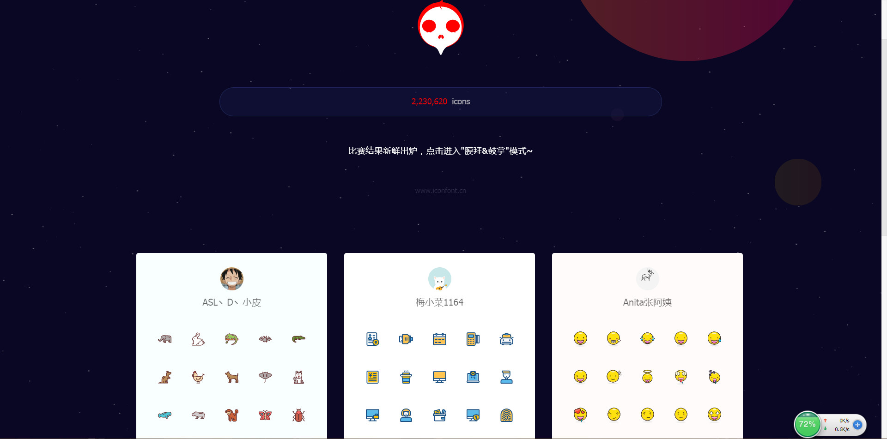


图片能做的很多事情，矢量图都能作，而且它只是往HTML里插入字符和CSS样式而已，和图片请求比起来资源占用完全不在一个数量级，如果你的项目里有小图标，就是用矢量图吧。

但如果我们做的是公司或者团队的项目，需要使用到许多自定义的字体图标，可爱的设计小姐姐们只是丢给你了几份`.svg`图片，你又该如何去做呢？

其实也很简单，阿里矢量图标库就提供了上传本地SVG资源的功能，这里另外推荐一个网站——icomoon。icomoon这个网站也为我们提供了将SVG图片自动转化成CSS样式的功能。（图片来自icomoon首页）

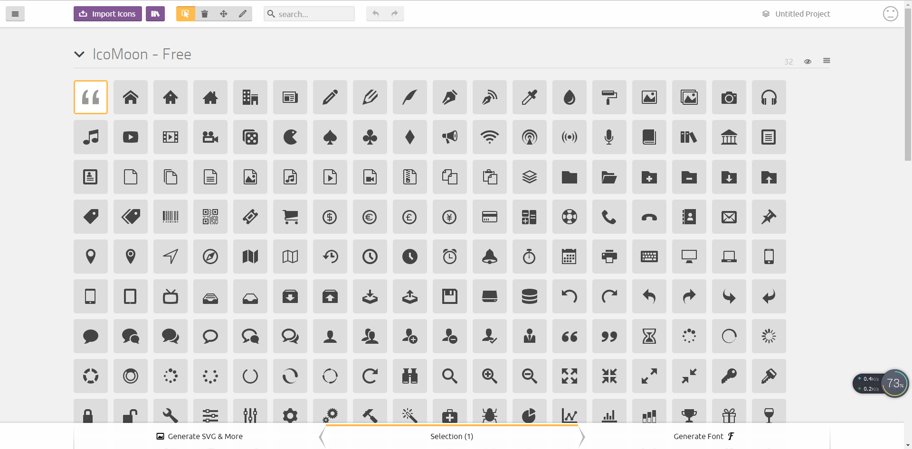

我们可以点击**Import Icons**按钮导入我们本地的SVG资源，然后选中他们，接下来生成CSS的事情，就交给icomoon吧，具体的操作，就和阿里矢量图标库类同了。

#### 1.3.4.使用WebP

WebP格式，是谷歌公司开发的一种旨在加快图片加载速度的图片格式。图片压缩体积大约只有JPEG的2/3，并能节省大量的服务器带宽资源和数据空间。Facebook、Ebay等知名网站已经开始测试并使用WebP格式。

我们可以使用官网提供的Linux命令行工具对项目中的图片进行WebP编码，也可以使用我们的线上服务，这里我推荐叉拍云（网址：https://www.upyun.com/webp）。但是在实际的上线工作中，我们还是得编写Shell脚本用命令行工具进行自动化编译，测试阶段用线上服务方便快捷。（图片来自叉拍云官网）


### 1.4.网络传输性能检测工具——Page Speed

除了network版块，其实chrome还为我们准备好了一款监测网络传输性能的插件——Page Speed，咱们的文章封面，就是用的Page Speed的官方宣传图（因为我觉得这张图再合适不过了）。我们只需要通过下面步骤安装，就可以在chrome devtools里找到它了：chrome菜单→更多工具→拓展程序→chrome网上应用商店→搜索pagespeed后安转即可。

（PS：使用chrome应用商店需要翻墙，怎么翻墙我就不便多说了）

这就是Page Speed的功能界面：

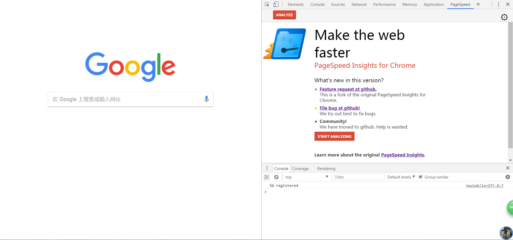

我们只需要打开待测试的网页，然后点击Page Speed里的 Start analyzing按钮，它就会自动帮我们测试网络传输性能了，这是我的网站测试结果：

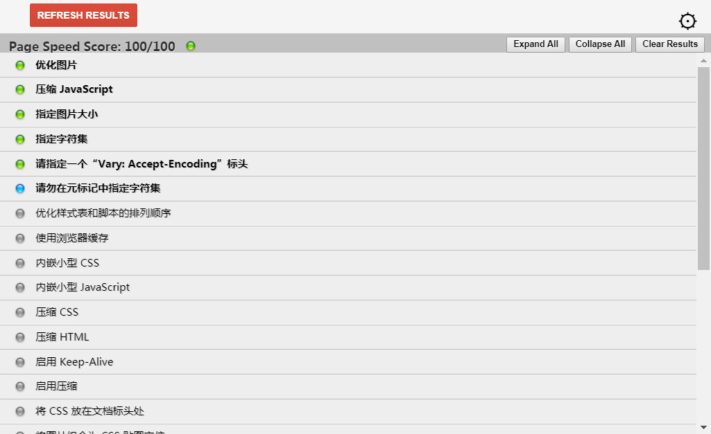

Page Speed最人性化的地方，便是它会对测试网站的性能瓶颈提出完整的建议，我们可以根据它的提示进行优化工作。这里我的网站已经优化到最好指标了(•́⌄•́๑)૭✧，Page Speed Score表示你的性能测试得分，100/100表示已经没有需要优化的地方。

优化完毕后再使用chorme devtools的network版块测量一下我们网页的白屏时间还有首屏时间，是不是得到了很大的提升？

### 1.5.使用CDN

Last but not least，

再好的性能优化实例，也必须在CDN的支撑下才能到达极致。

如果我们在Linux下使用命令`$ traceroute targetIp` 或者在Windows下使用批处理 `> tracert targetIp`，都可以定位用户与目标计算机之间经过的所有路由器，不言而喻，用户和服务器之间距离越远，经过的路由器越多，延迟也就越高。使用CDN的目的之一便是解决这一问题，当然不仅仅如此，CDN还可以分担IDC压力。

当然，凭着我们单个人的资金实力（除非你是王思聪）是必定搭建不起来CDN的，不过我们可以使用各大企业提供的服务，诸如腾讯云等，配置也十分简单，这里就请大家自行去推敲啦。

## 2.页面渲染性能优化

### 2.1.浏览器渲染过程（Webkit）

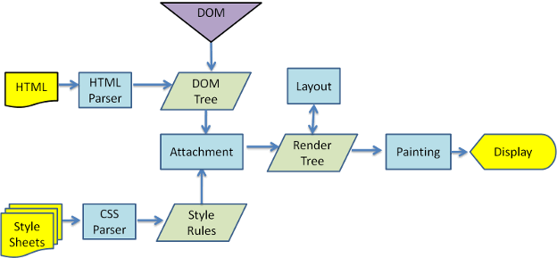

其实大家应该对浏览器将的HTML渲染机制比较熟悉了，基本流程同上图所述，大家在入门的时候，你的导师或者前辈可能会告诉你，在渲染方面我们要减少重排和重绘，因为他们会影响浏览器性能。不过你一定不知道其中原理是什么，对吧。今天我们就结合《Webkit技术内幕》（这本书我还是很推荐大家买来看看，好歹作为一名前端工程师，你得知道我们天天接触的浏览器内核是怎样工作的）的相关知识，给大家普及普及那些深层次的概念。

PS：这里提到了Webkit内核，我顺带提一下浏览器内部的渲染引擎、解释器等组件的关系，因为经常有师弟或者一些前端爱好者向我问这方面的知识，分不清他们的关系，我就拿一张图来说明：（如果你对着不感兴趣，可以直接跳过）

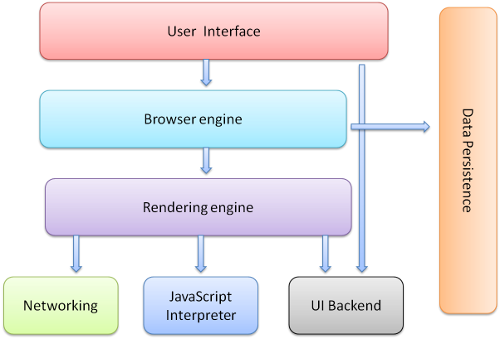

浏览器的解释器，是包括在渲染引擎内的，我们常说的Chrome（现在使用的是Blink引擎）和Safari使用的Webkit引擎，Firefox使用的Gecko引擎，指的就是渲染引擎。而在渲染引擎内，还包括着我们的HTML解释器（渲染时用于构造DOM树）、CSS解释器（渲染时用于合成CSS规则）还有我们的JS解释器。不过后来，由于JS的使用越来越重要，工作越来越繁杂，所以JS解释器也渐渐独立出来，成为了单独的JS引擎，就像众所周知的V8引擎，我们经常接触的Node.js也是用的它。

### 2.2.DOM渲染层与GPU硬件加速

如果我告诉你，一个页面是有许多许多层级组成的，他们就像千层面那样，你能想象出这个页面实际的样子吗？这里为了便于大家想象，我附上一张之前Firefox的3D View插件的页面Layers层级图：


对，你没看错，页面的真实样子就是这样，是由多个DOM元素渲染层（Layers）组成的，实际上一个页面在构建完render tree之后，是经历了这样的流程才最终呈现在我们面前的：

①浏览器会先获取DOM树并依据样式将其分割成多个独立的渲染层

②CPU将每个层绘制进绘图中

③将位图作为纹理上传至GPU（显卡）绘制

④GPU将所有的渲染层缓存（如果下次上传的渲染层没有发生变化，GPU就不需要对其进行重绘）并复合多个渲染层最终形成我们的图像

从上面的步骤我们可以知道，布局是由CPU处理的，而绘制则是由GPU完成的。

其实在chrome中，也为我们提供了相关插件供我们查看页面渲染层的分布情况，以及GPU的占用率：（所以说，平时我们得多去尝试尝试chrome的那些莫名其妙的插件，真的会发现好多东西都是神器）

chrome开发者工具菜单→more tools→Layers（开启渲染层功能模块）

chrome开发者工具菜单→more tools→rendering（开启渲染性能监测工具）

执行上面的操作后，你会在浏览器里看到这样的效果：

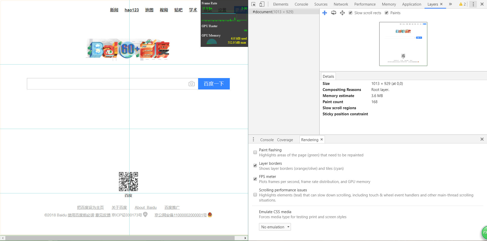

太多东西了，分模块讲吧：

（一）最先是页面右上方的小黑窗：其实提示已经说的很清楚了，它显示的就是我们的GPU占用率，能够让我们清楚地知道页面是否发生了大量的重绘。

（二）Layers版块：这就是用于显示我们刚提到的DOM渲染层的工具了，左侧的列表里将会列出页面里存在哪些渲染层，还有这些渲染层的详细信息。

（三）Rendering版块：这个版块和我们的控制台在同一个地方，大家可别找不到它。前三个勾选项是我们最常使用的，让我来给大家解释一下他们的功能（充当一次免费翻译）

①Paint flashing：勾选之后会对页面中发生重绘的元素高亮显示

②Layer borders：和我们的Layer版块功能类似，它会用高亮边界突出我们页面中的各个渲染层

③FPS meter：就是开启我们在（一）中提到的小黑窗，用于观察我们的GPU占用率

可能大家会问我，和我提到DOM渲染层这么深的概念有什么用啊，好像跟性能优化没一点关系啊？大家应该还记得我刚说到GPU会对我们的渲染层作缓存对吧，那么大家试想一下，如果我们把那些一直发生大量重排重绘的元素提取出来，单独触发一个渲染层，那样这个元素不就不会“连累”其他元素一块重绘了对吧。

那么问题来了，什么情况下会触发渲染层呢？大家只要记住：

video元素、WebGL、Canvas、CSS3 3D、CSS滤镜、z-index大于某个相邻节点的元素都会触发新的Layer，其实我们最常用的方法，就是给某个元素加上下面的样式：

```css
transform: translateZ(0);
backface-visibility: hidden;
```

这样就可以触发渲染层啦(*^__^*) 。

我们把容易触发重排重绘的元素单独触发渲染层，让它与那些“静态”元素隔离，让GPU分担更多的渲染工作，我们通常把这样的措施成为硬件加速，或者是GPU加速。大家之前肯定听过这个说法，现在完全清楚它的原理了吧。

### 2.3.重排与重绘

现在到我们的重头戏了，重排和重绘。先抛出概念：

①重排（reflow）：渲染层内的元素布局发生修改，都会导致页面重新排列，比如窗口的尺寸发生变化、删除或添加DOM元素，修改了影响元素盒子大小的CSS属性（诸如：width、height、padding）。

②重绘（repaint）：绘制，即渲染上色，所有对元素的视觉表现属性的修改，都会引发重绘。

我们习惯使用chrome devtools中的performance版块来测量页面重排重绘所占据的时间：


①蓝色部分：HTML解析和网络通信占用的时间

②黄色部分：JavaScript语句执行所占用时间

③紫色部分：重排占用时间

④绿色部分：重绘占用时间

不论是重排还是重绘，都会阻塞浏览器。要提高网页性能，就要降低重排和重绘的频率和成本，近可能少地触发重新渲染。正如我们在2.3中提到的，重排是由CPU处理的，而重绘是由GPU处理的，CPU的处理效率远不及GPU，并且重排一定会引发重绘，而重绘不一定会引发重排。所以在性能优化工作中，我们更应当着重减少重排的发生。

这里给大家推荐一个网站，里面详细列出了哪些CSS属性在不同的渲染引擎中是否会触发重排或重绘：

https://csstriggers.com/   （图片来自官网）

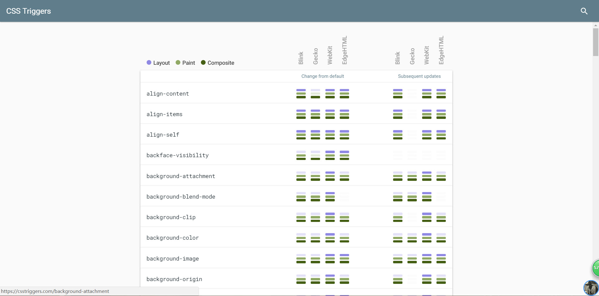

### 2.4.优化策略

谈了那么多理论，最实际不过的，就是解决方案，大家一定都等着急了吧，做好准备，一大波干货来袭：

（一）CSS属性读写分离：浏览器没次对元素样式进行读操作时，都必须进行一次重新渲染（重排 + 重绘），所以我们在使用JS对元素样式进行读写操作时，最好将两者分离开，先读后写，避免出现两者交叉使用的情况。最最最客观的解决方案，就是不用JS去操作元素样式，这也是我最推荐的。

（二）通过切换class或者style.csstext属性去批量操作元素样式

（三）DOM元素离线更新：当对DOM进行相关操作时，例如innerHTML、appendChild等都可以使用Document Fragment对象进行离线操作，带元素“组装”完成后再一次插入页面，或者使用`display:none` 对元素隐藏，在元素“消失”后进行相关操作。

（四）将没用的元素设为不可见：`visibility: hidden`，这样可以减小重绘的压力，必要的时候再将元素显示。

（五）压缩DOM的深度，一个渲染层内不要有过深的子元素，少用DOM完成页面样式，多使用伪元素或者box-shadow取代。

（六）图片在渲染前指定大小：因为img元素是内联元素，所以在加载图片后会改变宽高，严重的情况会导致整个页面重排，所以最好在渲染前就指定其大小，或者让其脱离文档流。

（七）对页面中可能发生大量重排重绘的元素单独触发渲染层，使用GPU分担CPU压力。（这项策略需要慎用，得着重考量以牺牲GPU占用率能否换来可期的性能优化，毕竟页面中存在太多的渲染层对与GPU而言也是一种不必要的压力，通常情况下，我们会对动画元素采取硬件加速。）

## 3.JS阻塞性能

JavaScript在网站开发中几乎已经确定了垄断地位，哪怕是一个再简单不过的静态页面，你都可能看到JS的存在，可以说，没有JS，就基本没有用户交互。然而，脚本带来的问题就是他会阻塞页面的平行下载，还会提高进程的CPU占用率。更有甚者，现在node.js已经在前端开发中普及，稍有不慎，我们引发了内存泄漏，或者在代码中误写了死循环，会直接造成我们的服务器奔溃。在如今这个JS已经遍布前后端的时代，性能的瓶颈不单单只是停留在影响用户体验上，还会有更多更为严重的问题，对JS的性能优化工作不可小觑。

在编程的过程中，如果我们使用了闭包后未将相关资源加以释放，或者引用了外链后未将其置空（比如给某DOM元素绑定了事件回调，后来却remove了该元素），都会造成内存泄漏的情况发生，进而大量占用用户的CPU，造成卡顿或死机。我们可以使用chrome提供的JavaScript Profile版块，开启方式同Layers等版块，这里我就不再多说了，直接上效果图：

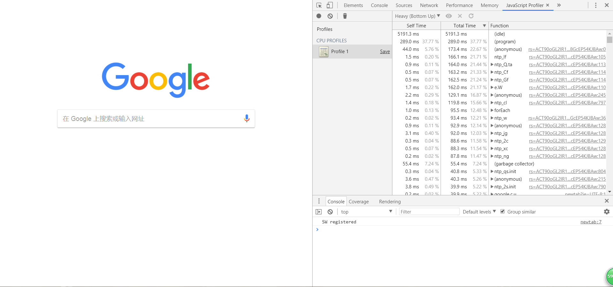

我们可以清除看见JS执行时各函数的执行时间以及CPU占用情况，如果我在代码里增加一行`while(true){}`, 那么它的占用率一定会飙升到一个异常的指标（亲测93.26%）。

其实浏览器强大的内存回收机制在大多数时候避免了这一情况的发生，即便用户发生了死机，他只要结束相关进程（或关闭浏览器）就可以解决这一问题，但我们要知道，同样的情况还会发生在我们的服务器端，也就是我们的node中，严重的情况，会直接造成我们的服务器宕机，网站奔溃。所以更多时候，我们都使用JavaScript Profile版块来进行我们的node服务的压力测试，搭配`node-inspector` 插件，我们能更有效地检测JS执行时各函数的CPU占用率，针对性地进行优化。

（PS：没修炼到一定水平，千万别在服务端使用闭包，一个是真没啥用，我们会有更多优良的解决办法，二是真的很容易内存泄漏，造成的后果是你无法预期的）

## 4.【拓展】负载均衡

之所以将负载均衡作为拓展内容，是因为如果是你自己搭建的个人网站，或者中小型网站，其实并不需要考虑多大的并发量，但是如果你搭建的是大型网站，负载均衡便是开发过程不可或缺的步骤。

### 4.1.Node.js处理IO密集型请求

现在的开发流程都注重前后端分离，也就是软件工程中常提到的“高内聚低耦合”的思想，你也可以用模块化的思想去理解，前后解耦就相当与把一个项目分成了前端和后端两个大模块，中间通过接口联系起来，分别进行开发。这样做有什么好处？我就举最有实际效果的一点：“异步编程”。这是我自己想的名字，因为我觉得前后解耦的形式很像我们JS中的异步队列，传统的开发模式是“同步”的，前端需要等后端封装好接口，知道了能拿什么数据，再去开发，时间短，工程大。而解耦之后，我们只需要提前约定好接口，前后两端就可以同时开发，不仅高效而且省时。

我们都知道node的核心是事件驱动，通过loop去异步处理用户请求，相比于传统的后端服务，它们都是将用户的每个请求分配一个进程进行处理，推荐大家去看这样一篇博文：https://mp.weixin.qq.com/s?__biz=MzAxOTc0NzExNg==&mid=2665513044&idx=1&sn=9b8526e9d641b970ee5ddac02dae3c57&scene=21#wechat_redirect 。特别生动地讲解了事件驱动的运行机制，通俗易懂。事件驱动的最大优势是什么？就是在高并发IO时，不会造成堵塞，对于直播类网站，这点是至关重要的，我们有成功的先例——快手，快手强大的IO高并发究其本质一定能追溯到node。

其实现在的企业级网站，都会搭建一层node作为中间层。大概的网站框架如图所示：

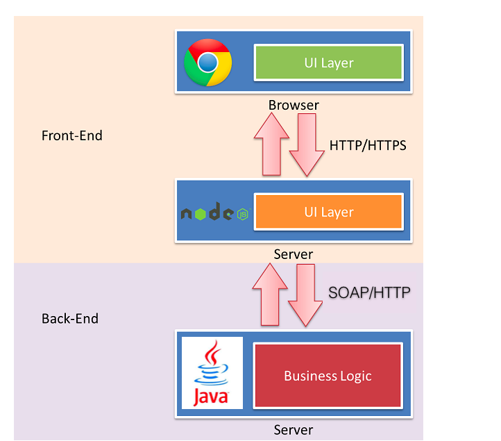

### 4.2.pm2实现Node.js“多进程”

我们都知道node的优劣，这里分享一份链接，找了挺久写的还算详细：https://www.zhihu.com/question/19653241/answer/15993549 。其实都是老套路，那些说node不行的都是指着node是单进程这一个软肋开撕，告诉你，我们有解决方案了——pm2。这是它的官网：http://pm2.keymetrics.io/ 。它是一款node.js进程管理器，具体的功能，就是能在你的计算机里的每一个内核都启动一个node.js服务，也就是说如果你的电脑或者服务器是多核处理器（现在也少见单核了吧），它就能启动多个node.js服务，并且它能够自动控制负载均衡，会自动将用户的请求分发至压力小的服务进程上处理。听起来这东西简直就是神器啊！而且它的功能远远不止这些，这里我就不作过多介绍了，大家知道我们在上线的时候需要用到它就行了，安装的方法也很简单，直接用npm下到全局就可以了`$ npm i pm2 -g`具体的使用方法还有相关特性可以参照官网。这里我在`build`文件夹内添加了`pm2.json`文件，这是pm2的启动配置文件，我们可以自行配置相关参数，具体可参考github源码，运行时我们只要在上线目录下输入命令`$ pm2 start pm2.json`即可。

下面是pm2启动后的效果图：

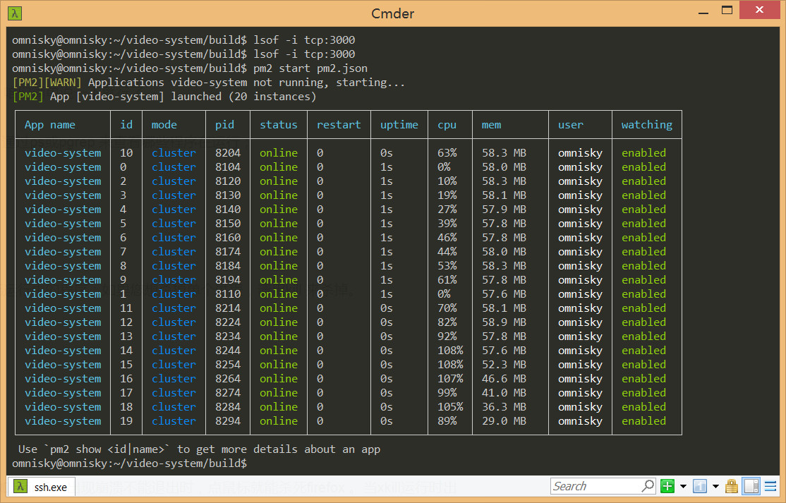

### 4.3.nginx搭建反向代理

在开始搭建工作之前，首先得知道什么是反向代理。可能大家对这个名词比较陌生，先上一张图：

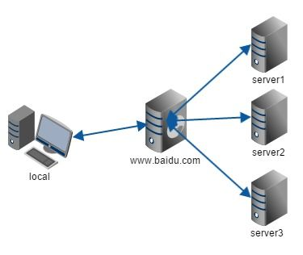

所谓代理就是我们通常所说的中介，网站的反向代理就是指那台介于用户和我们真实服务器之间的服务器（说的我都拗口了），它的作用便是能够将用户的请求分配到压力较小的服务器上，其机制是轮询。听完这句话是不是感觉很耳熟，没错，在我介绍pm2的时候也说过同样的话，反向代理起到的作用同pm2一样也是实现负载均衡，你现在应该也明白了两者之间的差异，反向代理是对服务器实现负载均衡，而pm2是对进程实现负载均衡。大家如果想深入了解反向代理的相关知识，我推荐知乎的一个贴子：https://www.zhihu.com/question/24723688 。但是大家会想到，配服务器是运维的事情啊，和我们前端有什么关系呢？的确，在这部分，我们的工作只有一些，只需要向运维提供一份配置文档即可。

```
http {
	upstream video {
		ip_hash;
		server localhost:3000;
	}
	server {
		listen: 8080;
		location / {
			proxy_pass: http://video
		}
	}
}
```

也就是说，在和运维对接的时候，我们只需要将上面这几行代码改为我们配置好的文档发送给他就行了，其他的事情，运维小哥会明白的，不用多说，都在酒里。

但是，这几行代码该怎么去改呢？首先我们得知道，在nginx中，模块被分为三大类：handler、filter和upstream。而其中的upstream模块，负责完成完成网络数据的接收、处理和转发，也是我们需要在反向代理中用到的模块。接下来我们将介绍配置代码里的内容所表示的含义

#### 4.3.1.upstream配置信息：

upstream关键字后紧跟的标识符是我们自定义的项目名称，通过一对花括号在其中增添我们的配置信息。

`ip_hash` 关键字：控制用户再次访问时是否连接到前一次连接的服务器

`server `关键字：我们真实服务器的地址，这里的内容肯定是需要我们去填写的，不然运维怎么知道你把项目放在那个服务器上了，也不知道你封装了一层node而得去监听3000端口。

#### 4.3.2.server配置信息

server是nginx的基本配置，我们需要通过server将我们定义的upstream应用到服务器上。

`listen`关键字：服务器监听的端口

`location`关键字：和我们之前在node层说到的路由是起同样的功能，这里是把用户的请求分配到对应的upstream上

## 5.拓展阅读

网站的性能与监测是一项复杂的工作，还有很多很多后续的工作，我之前所提到的这些，也只能算是冰山一角，在熟悉开发规范的同时，也需要实践经验的积累。

在翻阅了许多与网站性能相关的书籍后，我还是更钟情于唐文前辈编著的《大型网站性能监测、分析与优化》，里面的知识较新，切合实际，至少我读完一遍后很有收获、醍醐灌顶，我也希望对性能感兴趣的读者在看完我的文章后能去翻翻这本著作。

这里笔者还建议大家平时有事没事可以多去看几遍雅虎军规，虽是老生常谈，但却字字珠玑。如果大家能熟记于心更是再好不过了，传送门：

https://www.cnblogs.com/xianyulaodi/p/5755079.html